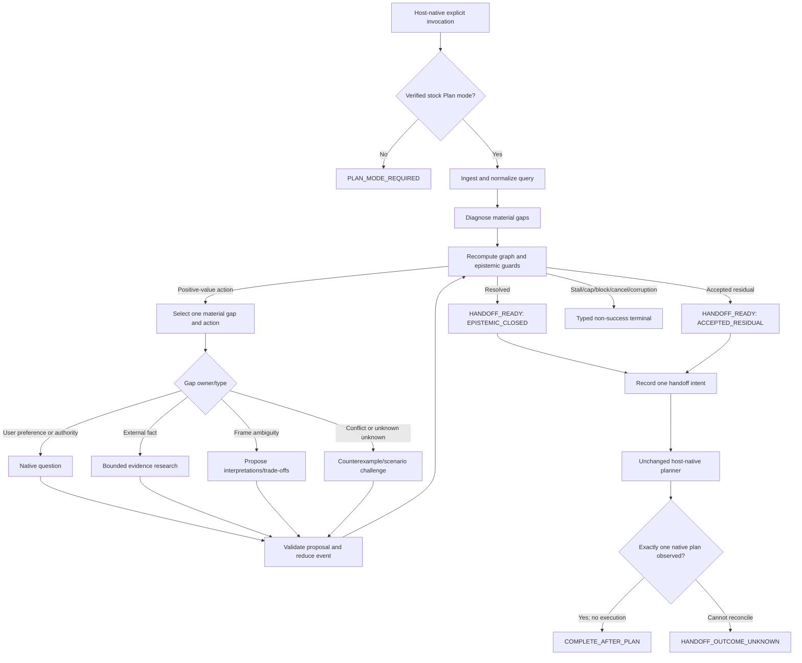

# ThyQuery Design Synthesis — Graph-Governed Ralph Pre-Planning

## Metadata

- Design ID: `DS`
- Version: `v2`
- Based on: approved `SK@v9-B`, SHA-256 `c392fdf495cfa407487d4f1894d0381f46de9a36c8f3be5cbd23c2b606ae520c`
- Retained product path: approved `DS@v1-B` / Path B
- Status: `DESIGN_APPROVAL_PENDING(DS@v2)`
- Recommended option: `B-GUARDED`
- Date: 2026-08-03 (Asia/Seoul)
- Authority used: bounded G1–G7 read-only research and root synthesis only
- Explicit exclusion: this document does not authorize implementation planning acceptance, code, scaffolding, package installation, configuration mutation, deployment, publication, or plan execution

## Research Receipt

| Lane | Artifact | Lines | Full-file SHA-256 | Integrated verdict |
|---|---|---:|---|---|
| G1 Microsoft | `G1_microsoft_graph.md` | 183 | `d6a675279bd79eeb8208d1c5f967e8a59587700aa84188bbfbd90a1a8df61b1c` | Workflow-graph capability is documented; matched-compute central-state/conditional-edge efficacy is not. |
| G2 Anthropic | `G2_anthropic_graph.md` | 348 | `f57b382cd1f3d00ed07d25138ee8ab24ecd8b3a35db970673e1c41a8c56d5a30` | Simple composable workflow guidance is supported; graph-topology causation is not. |
| G3 Stanford | `G3_stanford_graph.md` | 246 | `79f6fbbdd1c88911e2617045fe232edb22cb8a30f7088f35fffd7e3067b69075` | The combined Stanford/LangGraph/GoT attribution is contradicted; closest Stanford work is only a near match. |
| G4 Independent evidence | `G4_graph_reasoning_evidence.md` | 147 | `1784901cbcd0b07fa51822fdb65adaf62508d965c6e7c0dbead458bfcd99e493` | Graph-primary Candidate A receives `NO_GRAPH_BENEFIT_SHOWN`; strong tree/voting/null counterevidence exists. |
| G5 Frameworks | `G5_frameworks.md` | 349 | `42e93654ca24583f1b330695b24b5aa6ebb36a18ba28aa5d07c617062488a2f7` | No runtime passes the joint gate; only a framework-neutral typed contract advances. |
| G6 Safety/stopping | `G6_graph_safety_stopping.md` | 627 | `520a0cba7725ff855772510ad5e8c0283d342ad744147ce03d4b4e15d2f11585` | Event-derived state, deterministic guards, bounded liveness, pure replay, and typed non-success are required. |
| G7 Evaluation/transfer | `G7_evaluation_transfer.md` | 607 | `618304019e09e62f7a986b4aecc7c1c6464cb328638c2e30e5edd888e56f60d5` | `C−B` isolates graph increment; both current host cells remain `CONFORMANCE_UNTESTED`. |

- Total research artifact lines: `2,507`.
- Root independently rechecked every full-file digest and read every artifact in full.
- Every lane reported zero descendants and only its assigned artifact.
- Every completed G1–G7 branch was interrupted/cleaned after integration; only non-running historical registry records remain.

## Executive Decision

The evidence does **not** support the claim that a graph is generally a better reasoning topology than a disciplined loop. It does support using an explicit state machine as a control and verification boundary when conditional routing, cancellation, typed failure, replay, and one-time handoff must be made inspectable.

Therefore the recommended architecture is `B-GUARDED`:

> One framework-neutral, deterministic outer control graph owns canonical state, guard precedence, legal transitions, budgets, terminal classification, and native-plan handoff. A bounded Ralph refinement region operates on one material intent gap at a time, but it never owns state commits or success authority.

This recommendation is made for **control integrity and testability**, not because published studies establish a ThyQuery quality gain. Any quality claim remains blocked until the matched `C−B` evaluation passes.

The design rejects four tempting inferences:

1. Microsoft/Anthropic/Stanford branding does not establish graph-topology efficacy.
2. A graph-of-thought benchmark gain does not transfer to an intent-resolution workflow graph.
3. A checkpoint does not establish safe replay or exactly-once external effect.
4. A cap, stable state, repeated wording, low model confidence, or model-authored `done` does not establish epistemic closure.

## Institutional and Evidence Verdicts

| Premise | Exact verdict | Design consequence |
|---|---|---|
| Microsoft proved central state plus conditional edges outperform an equivalent loop | `contradicts_premise` at the claimed scope | Use Agent Framework/GraphFlow vocabulary only as capability references; run a local matched comparison. |
| Anthropic proved graph-structured control itself improves performance | `insufficient`; adjacent multi-agent gains are confounded | Retain simplicity-first, cost/latency, routing, evaluator, and state/event guidance; do not import an orchestrator runtime. |
| Stanford originated the combined TypedDict/conditional-edge and GoT result | `contradicts_premise` | Treat the Stanford course material as a Microsoft/LangGraph presentation; GoT is non-Stanford research. |
| GoT's 62% result predicts ThyQuery improvement | `contradicts_premise` | The result is task-specific sorting-error reduction with a task-authored controller; no product prior is assigned. |
| Graphs are broadly superior to trees/chains/voting | `contradicts_premise` | Preserve graph-primary rejection, tree/checklist negative controls, and task-stratified no-harm gates. |
| Explicit control state/guards can improve auditability and enforce invariants | `near_match_only` but structurally relevant | Adopt as a design hypothesis whose conformance is model-free testable. |

Selected primary navigation includes [Microsoft GraphFlow](https://microsoft.github.io/autogen/stable/user-guide/agentchat-user-guide/graph-flow.html), [Microsoft Agent Framework Workflows](https://learn.microsoft.com/en-us/agent-framework/workflows/), [Anthropic's workflow guidance](https://www.anthropic.com/engineering/building-effective-agents), [Graph of Thoughts](https://arxiv.org/abs/2308.09687), [Tree of Problems](https://aclanthology.org/2024.emnlp-main.1001/), [AgentFlow](https://arxiv.org/abs/2510.05592), [W3C SCXML](https://www.w3.org/TR/scxml/), and [LangGraph checkpoint semantics](https://docs.langchain.com/oss/python/langgraph/checkpointers). Full source ledgers and exact task/budget limitations are in G1–G7.

## Architecture Options

### A — Graph-primary reasoning/controller

- The graph owns both reasoning topology and every control transition.
- Potential benefit: maximum explicit topology and inspection.
- Evidence result: `NO_GRAPH_BENEFIT_SHOWN`.
- Decisive problems: task-authored topology, framework weight, brittle schemas, extra calls/search/training, and direct counterexamples where trees/CoT/voting match or beat graphs.
- Disposition: `REJECT_CURRENT_EVIDENCE`.

### B-GUARDED — Deterministic outer graph with bounded Ralph refinement

- A small outer state machine owns lifecycle, state integrity, routing guards, terminal decisions, and handoff.
- Ralph is a bounded cyclic region for one material gap; every iteration returns a typed proposal to the sole reducer.
- The graph is a workflow/control graph, not GoT, a knowledge graph, a multi-agent graph, or a second planner.
- No external graph runtime is selected.
- Benefit hypothesis: clearer state ownership, fewer illegal transitions, safer cancellation/replay/handoff, and potentially better action routing.
- Risk: two-layer duplication, schema rigidity, and graph overhead.
- Mitigation: there is only one authoritative controller; the Ralph region owns neither commits nor closure. Retain it only if `C−B` and no-harm gates pass.
- Disposition: `RECOMMENDED_NOT_APPROVED`.

### C — Ralph-primary loop with passive graph shadow

- The existing Ralph loop remains authoritative; a graph records dependencies, invalidations, alternatives, and trace diagnostics.
- Benefit: smallest behavioral change and strongest negative-control baseline.
- Limitation: conditional edges and central state are advisory, so it does not fully realize the requested control model.
- No reasoning-quality claim is permitted for a passive shadow.
- Disposition: `FALLBACK_AND_EVALUATION_CONTROL`.

| Criterion | A | B-GUARDED | C |
|---|---:|---:|---:|
| Authoritative central state/edges | Strong | Strong | Weak/advisory |
| Published general efficacy | Not shown | Not shown | Not shown |
| Thin-plugin fit | Poor | Best attainable | Best |
| Deterministic terminal control | Strong but heavy | Strong and bounded | Must be bolted onto loop |
| Loop simplicity retained | No | Yes, inside one region | Yes |
| Framework dependency | Likely | None selected | None selected |
| Recommended | No | Yes, conditional on evaluation | Fallback |

## Selected Logical Architecture



The diagram is logical, not an implementation promise. Exact host events, storage, and native-plan receipts remain conformance questions.

## Retained Product and Host Boundary

| Boundary | Codex | Claude Code | Current status |
|---|---|---|---|
| Explicit invocation | `$thyquery <query>` | `/thyquery:thyquery <query>` | Official grammars supported; plugin instances unbuilt/uninstalled. |
| Entry mode | User is already in stock Plan | User is already in stock Plan | Required; no mode mutation. |
| Outside Plan | `PLAN_MODE_REQUIRED` only | `PLAN_MODE_REQUIRED` only | Behavioral requirement, untested. |
| Native question | Host-native structured question surface | `AskUserQuestion`-class native surface | Exact adapter/event receipt untested. |
| Final artifact | One operationally native stock plan | One operationally native stock plan | Exact linkage and exactly-once observation untested. |
| After plan | Stop before approval/execution | Stop before approval/implementation continuation | Hard invariant, untested. |

Ordinary prompts remain untouched. ThyQuery has no automatic interception, no automatic mode switch, no wrapper CLI, no daemon, no proxy, no remote controller, no second planner, and no execution authority.

Both pinned local host cells remain `CONFORMANCE_UNTESTED`; design quality cannot turn them into a compatibility pass.

## Canonical State Contract

### Authority model

- One invocation has one logical commit owner.
- Nodes, tools, the model, user, and host may propose typed events; none directly mutates canonical state.
- Canonical state is a deterministic view derived from an ordered logical event sequence under pinned schema, policy, and reducer versions.
- An in-memory invocation log is the privacy/thinness default candidate. Durable recovery is optional and deferred; if later approved, it must use a redacted host-local checkpoint with explicit retention and restore validation.
- A snapshot is a cache validated against event position and digest, never a second authority.
- Parallel authoritative writes are excluded from the minimum design. They require explicit reducer laws and conformance tests before admission.

### Event envelope

Every authoritative candidate event contains at least:

```text
event_id
invocation_id
event_type                # closed, versioned enum
schema_version
expected_state_version
expected_state_hash
idempotency_key
producer_kind             # USER | HOST | TOOL | MODEL_PROPOSAL | CONTROLLER
producer_receipt
typed_payload
evidence_refs
policy_version
reducer_version
created_at                # audit metadata, never ordering authority
```

Same key plus the same canonical payload returns the prior receipt without a transition. Same key plus a different payload is `STATE_CORRUPT(KEY_COLLISION)`.

### Derived state partitions

| Partition | Minimum contents |
|---|---|
| `identity` | Invocation/session, host/version/surface, original-query digest, context and authority manifest |
| `lifecycle` | Current node, enter event, wait/cancel state, typed terminal and reason |
| `plan_preflight` | Starting/effective mode and host-owned Plan evidence or explicit absence |
| `contract` | Goal, deliverable, audience, scope, constraints, priorities, evidence standard, acceptance criteria, exclusions, residuals |
| `provenance` | `user_explicit`, `user_confirmed`, `evidence_derived`, `model_inferred`, `rejected`, `deferred`, `residual` |
| `evidence` | Sources, dates, scope, freshness, contradictions, supersessions, unsupported claims |
| `gaps` | Criticality, owner, ambiguity type, materiality, dependencies, open-world challenge state |
| `action_space` | Admissible actions, expected value/risk/burden/privacy estimates and uncertainty |
| `closure` | `C,R,X,D,NVI,A` bounds, philosophical guards, calibration stratum/version, decision receipt |
| `progress` | Material deltas, full/semantic digests, action history, SCC/repeat/oscillation/stall diagnostics |
| `budgets` | Transition, question, source/tool, token, time/deadline, privacy, and cost consumption |
| `integrity` | State/event versions, hashes, reducer/policy versions, replay and rejected-write receipts |
| `handoff` | Closure kind, contract digest, one logical intent key, host/plan receipt, plan digest, count |
| `privacy` | Field classification, minimum-disclosure projection, trace/checkpoint redaction and retention state |

Corrections supersede prior facts and invalidate dependent conclusions; they do not silently erase history. Physical deletion/redaction is a separate privacy operation and may reduce replay scope honestly.

## Node and Ralph Responsibilities

The outer graph owns:

- Plan/capability preflight;
- canonical event validation and reduction;
- material-gap inventory;
- admissible-action generation rules;
- deterministic hard guards and edge precedence;
- budget, repetition, SCC, stall, and liveness diagnostics;
- closure recomputation and typed terminal selection;
- one logical native-plan handoff and final absorption.

The bounded Ralph region owns only:

1. focus on one currently highest-materiality gap;
2. produce one typed next-action proposal or a bounded set of neutral interpretations when the user must choose;
3. use research for external facts and native questions for user-owned preferences/authority;
4. perform a counterexample/open-world challenge when the hypothesis frame may be wrong;
5. return evidence and the proposed contract delta to the controller;
6. repeat only after a committed material delta, exogenous novelty, or another admissible action with positive upper net value.

There is no fixed Top 3 and no fixed question count. Option count and interaction form are adapted to the current gap and verified host surface. A prose paraphrase, self-critique, or unchanged confidence score is not progress.

## Deterministic Guard Precedence

All predicates are evaluated against one canonical post-event snapshot. The first applicable class wins:

1. `P0 CANCEL/EFFECT_FENCE`: trusted cancel immediately prevents new or pending effects; cancellation wins over a simultaneous closure proposal.
2. `P1 IDENTITY/INTEGRITY/ABSORPTION`: owner, terminal absorption, deduplication, schema, predecessor version/hash, reducer/policy version, legal transition, and handoff-count checks.
3. `P2 HOST/NON-WAIVABLE`: verified Plan, required native surfaces, authority, safety, privacy, and host contradictions.
4. `P3 RESOLVED_CLOSURE`: independently recomputed graph plus epistemic gate, bound to the current contract digest.
5. `P4 ACCEPTED_RESIDUAL`: explicit authorized acceptance of an enumerated residual ledger; no non-waivable failure.
6. `P5 RESOURCE_EXHAUSTION`: no new active action begins at zero budget; emit `RESOURCE_EXHAUSTED`.
7. `P6 PROGRESS_FAILURE`: exact repeat, oscillation, calibrated semantic stall, dead end, non-decreasing variant, or unproductive SCC emits `STALLED` or graph-definition corruption.
8. `P7 UNCERTAINTY_OWNER`: frame correction; user question; bounded evidence; challenge; or delta confirmation.
9. `P8 ACTION_RANKING`: select by frozen decision-loss/value/burden policy; stable edge ID is only the final tie-break.

If incompatible edges remain enabled at the same declared priority without a tie-break, emit `STATE_CORRUPT(EDGE_CONFLICT)`. Model confidence, list order, or whichever asynchronous result returns first cannot decide a safety edge.

A closure that becomes valid on the final permitted transition may precede the now-zero remaining budget only because independent evidence satisfied closure; the cap itself contributes no success evidence.

## Researched Closure and Stop Conditions

### Decision-relative action value

```text
d_t       := argmin_d E[L(d, Θ) | H_t]
R_t       := min_d E[L(d, Θ) | H_t]
EVSI_t(a) := R_t - E[R_(t+1) | H_t, a]
NVI_t(a)  := EVSI_t(a) - Cost_t(a)

NVI_H(B) := E[R_t - R_(t+H) | bounded batch/policy B]
            - E[cumulative Cost(B)]
```

`Cost` is a constrained vector before any scalarization: user time/cognitive burden, privacy exposure, latency, tool/source use, money/compute, redundancy, and intent-drift risk. Non-waivable privacy, authority, and safety limits are hard constraints rather than tradable costs.

### Graph, philosophical, and epistemic gates

```text
GRAPH_OK_t :=
  invocation_and_plan_identity_valid
  AND replay_lineage_schema_and_transition_valid
  AND no_edge_or_reducer_conflict
  AND not_cancelled
  AND no_nonwaivable_or_host_gate_failed
  AND no_dead_end_repeat_stall_oscillation_or_unproductive_scc
  AND policy_and_calibration_versions_valid
  AND handoff_count = 0
  AND no_execution_effect_observed

PHILOSOPHICAL_OK_t :=
  no_material_conflict_among_user_endorsed_commitments
  AND every_high_impact_implicature IN {confirmed, rejected, residualized}
  AND counterexample_or_open_world_challenge_completed
  AND no_unaccepted_frame_revision
  AND genuine_correct_defer_cancel_paths_were_available
  AND tacit_residuals_and_epistemic_limits_are_explicit

COVERAGE_OK_t := Ccrit_t AND LCB(C_t) >= tau_C[stratum]
RISK_OK_t     := UCB_R(t) <= tau_R[stratum]
CONFLICT_OK_t := Xcrit_t = 0 AND targeted_challenge_passed
STABLE_OK_t   := UCB_D(t) <= epsilon_D[stratum] over window k
VOI_OK_t      :=
  UCB(max admissible one-step NVI_t) <= 0
  AND UCB(max required 2..H lookahead NVI_H) <= 0
CAL_OK_t      := calibration valid for current host/domain/language/risk stratum

EPISTEMIC_CLOSED_t :=
  GRAPH_OK_t
  AND PHILOSOPHICAL_OK_t
  AND COVERAGE_OK_t AND RISK_OK_t AND CONFLICT_OK_t
  AND STABLE_OK_t AND VOI_OK_t AND CAL_OK_t
  AND plan_input_ready
  AND no_unauthorized_intent_drift
  AND explicit_resolved_acceptance_binds_current_contract_digest
```

This is a testable design hypothesis, not a universal theorem. Stability is necessary support only. One-step VOI is insufficient unless diminishing returns/no synergy is proved; otherwise the bounded lookahead guard is mandatory. A wrong hypothesis space can look stable and low-value, so open-world challenge and residual paths remain mandatory.

### Residual acceptance

```text
ACCEPTED_RESIDUAL_t :=
  GRAPH_OK_except_epistemic_thresholds
  AND every_residual_has_provenance_impact_mitigation_reversibility_owner
  AND authorized_user_accepts_the_current_residual_ledger_digest
  AND no_nonwaivable_gate_failed
```

Bare assent such as “괜찮아” without an enumerated current ledger does not pass.

### What each stop signal means

| Signal | Success? | Native-plan handoff? |
|---|---:|---:|
| `EPISTEMIC_CLOSED` | Yes, decision-sufficient only | Yes |
| `ACCEPTED_RESIDUAL` | Separate accepted-risk outcome | Yes |
| `CANCELLED` | No | No |
| `PLAN_MODE_REQUIRED` | No | No |
| `BLOCKED` / `INFEASIBLE` | No | No |
| `STALLED` | No | No |
| `RESOURCE_EXHAUSTED` | No | No |
| `STATE_CORRUPT` | No | No |
| `HOST_CAPABILITY_CONTRADICTION` | No | No |
| `HANDOFF_OUTCOME_UNKNOWN` | No success claim | No blind retry |
| `COMPLETE_AFTER_PLAN` | Product terminal after one observed native plan | Already handed off once |

Complete extraction of all tacit knowledge is not an outcome. The success target is task-relative, decision-sufficient grounding with explicit residuals.

## Bounded Liveness, Cycles, and Formal Checks

Let `B(S) ∈ N` be the remaining active-transition budget.

```text
B(START) = B0 < infinity
every committed active macrostep decreases B by exactly 1
duplicate/rejected events do not count as progress
no active action starts at B = 0
at B = 0, absent a higher-priority already-valid terminal,
  the only route is RESOURCE_EXHAUSTED
every validator/reducer/guard terminates on bounded payloads
```

This proves finite **internal** work under its assumptions; it does not prove epistemic success or wall-clock completion. A user/host wait additionally needs an environment event—reply, cancel, failure, or deadline. Both hosts' delivery/deadline guarantees remain unverified.

Before any implementation acceptance, the frozen graph must pass:

- forward and reverse reachability;
- one positive and one negative fixture per edge guard;
- guard totality and deterministic conflict resolution;
- terminal absorption and forbidden-path checks;
- handoff dominator checks;
- SCC decomposition plus satisfiable-exit fixtures;
- exact-repeat, period-`p` oscillation, semantic-stall, productive-cycle, and unproductive-SCC fixtures;
- invariant induction over the finalized transition set;
- a bounded finite model or exhaustive fixture check for cancellation, cap, handoff, and replay counterexamples.

An SCC is not automatically a livelock, and an exit edge does not prove its guard is satisfiable or eventually selected.

## Replay, Idempotency, and Native-Plan Handoff

- Verification replay is a pure reducer fold over recorded envelopes and must issue zero user questions, network/tool calls, interrupts, or planner calls.
- Runtime “time travel” that re-executes later LLM/API/interrupt steps is not audit replay.
- Controller deduplication establishes at-most-once logical handoff intent, not exactly-once host effect.
- Handoff key candidate: `H(invocation_id, current_contract_hash)`.
- After uncertainty/crash, retry is allowed only if the host proves non-application or documents idempotency for the same key.
- If applied versus unapplied cannot be reconciled, emit `HANDOFF_OUTCOME_UNKNOWN` and stop.
- A conformance pass requires exactly one observed operationally native plan, but the design does not claim that either current host already exposes the required authoritative receipt.
- `COMPLETE_AFTER_PLAN` is absorbing; any plan-action execution, edit, shell/tool action, approval continuation, second plan, or ThyQuery re-entry is a hard failure.

## Framework Decision

No runtime framework is selected or installed.

| Disposition | Candidates | Reason |
|---|---|---|
| `ADOPT_CANDIDATE` as specification only | Framework-neutral typed control contract | Preserves semantics while keeping the two plugins thin and the runtime decision reversible. |
| `REFERENCE_ONLY` | LangGraph, Microsoft Agent Framework, LlamaIndex Workflows, Pydantic Graph, Haystack, Apache Burr | Useful typed state/edge/checkpoint/test semantics; no exact two-host or efficacy proof. |
| `REFERENCE_ONLY`, lower priority | AutoGen GraphFlow, Mastra, CrewAI | Experimental/maintenance or broader dependency surfaces. |
| `OUT_OF_SCOPE` | Semantic Kernel Process, Temporal, Prefect | Experimental status or daemon/service/configuration boundary conflicts. |

Any later approved runtime prototype must first pass the identical framework-neutral, model-free fixture corpus. Package popularity or feature count is not a selection metric.

## Preregisterable Evaluation

### Four arms

| Arm | Mechanism | Purpose |
|---|---|---|
| A — Stock | Raw query to unchanged stock Plan behavior | Product baseline |
| B — Loop-only | Same contract/actions/prompts/tools/budgets as C, sequential Ralph without graph mediation | Loop/contract increment |
| C — B-GUARDED | Typed state, guarded edges, cycle accounting, same Ralph/action surface as B | Graph increment `C−B` |
| D — Oracle | Full sealed dossier rendered as a contract, then identical stock planner | Native-planner ceiling |

B and C must pin the same host, model, prompts, tools, evidence, user simulator/participant policy, contract schema, question/action repertoire, termination envelope, and native planner. C receives no extra facts, calls, tokens, tools, or sources.

Additional negative controls:

- graph shadow generated but hidden from control;
- shuffled or irrelevant edges;
- simpler checklist/tree state using the same budget;
- ablations for state integrity, guard precedence, SCC/stall, lookahead VOI, philosophical guard, and explicit acceptance.

### Separate endpoints

1. contract-to-dossier decision-critical recovery;
2. plan-to-contract native-planner fidelity;
3. plan-to-dossier end-to-end fidelity;
4. graph/state/route/terminal correctness;
5. exact host conformance and no-execution evidence;
6. user burden, privacy, no-harm, latency, tokens, sources, and cost;
7. repeated-trial `pass^k` reliability.

### Hard claim gates

| Gate | Requirement | Failure verdict |
|---|---|---|
| G0 Host | Exact host/version/surface Plan, invocation, native question, one plan, no execution fixtures pass | `HOST_UNSUPPORTED` |
| G1 Trace | No state, privacy, terminal, replay, cancellation, or handoff invariant failure | `TRACE_INVALID` |
| G2 Graph increment | Paired `C−B` meets frozen practical-effect/uncertainty rule and all no-regression margins | `NO_GRAPH_BENEFIT_SHOWN` |
| G3 Downstream | Contract gain also survives native-plan/end-to-end gate | Otherwise claim contract recovery only |
| G4 Oracle | D establishes an adequate native-planner ceiling | Report planner bottleneck |
| G5 Transfer | Each claimed host passes independently | No cross-host generalization |
| G6 Burden/privacy/no-harm | Clear-query, burden, cost, privacy, and reliability margins hold | Reject broad benefit claim |

Use a pilot to calibrate task strata, `tau_C`, `tau_R`, `epsilon_D`, semantic equivalence, stall windows, lookahead horizon, budgets, minimum practical effect, no-harm/burden margins, sample size, `pass^k` value, and grader reliability. Freeze them before a held-out confirmatory run. No universal numbers are asserted in this design.

## Permitted and Forbidden Claims

### Permitted now

- Graph/workflow frameworks expose useful typed state, conditional routing, checkpoint, and test patterns.
- Published graph results are task- and resource-dependent.
- A deterministic control graph is a defensible design hypothesis for state/transition integrity.
- A matched evaluation can isolate its incremental value.

### Forbidden now

- “Microsoft, Anthropic, or Stanford proved ThyQuery's graph will perform better.”
- “Graph thinking is SOTA for ambiguous intent resolution.”
- “The 62% GoT result predicts a 62% ThyQuery gain.”
- “The graph has converged, therefore the user's tacit knowledge is solved.”
- “Checkpoint/replay guarantees exactly once.”
- “Both plugins are compatible” before exact G0 runs.
- “DS approval authorizes implementation.”

## Field-Level Diff from SK@v9-B

| Field | SK@v9-B research target | DS@v2 recommendation |
|---|---|---|
| Architecture | A/B/C open | `B-GUARDED`; A rejected, C retained as fallback/control |
| Graph category | Control and reasoning graphs both under study | Only a workflow/control graph is authoritative; GoT/KG/program/multi-agent gains do not transfer |
| State authority | Mutable versus event-derived open | Single-writer ordered logical events plus deterministic derived view |
| Persistence | Research question | In-memory invocation default candidate; optional redacted host-local checkpoint deferred |
| Parallel writes | Reducer/concurrency open | Excluded from minimum design unless reducer laws are proved and tested |
| Ralph relation | Hierarchy open | Bounded one-gap refinement region; no commit or terminal authority |
| Edge selection | Exact order open | Frozen P0–P8 precedence with fail-closed edge conflicts |
| Closure | Graph-aware candidate invariants | `GRAPH_OK ∧ PHILOSOPHICAL_OK ∧ R4 calibrated gate ∧ current-digest acceptance` |
| Liveness | Research question | Finite internal variant proof; external wait liveness explicitly unproved |
| Cycles | Repetition/SCC candidates | Static reachability/SCC plus satisfiable exits and runtime semantic-progress guards |
| Replay | Framework feature under study | Pure effect-free reducer replay only |
| Handoff | Exactly-once target | At-most-once logical intent; host exactly-once effect remains a conformance requirement/unknown |
| Framework | Optional | No runtime selected; neutral contract only |
| Evaluation | A/B/C/D hypothesis | Fixed `C−B`, negative controls, per-host G0–G6 gates, pilot/confirmatory split |
| Host status | To be evaluated | Codex 0.146.0 and Claude Code 2.1.220 remain `CONFORMANCE_UNTESTED` |
| Performance claim | Provisional | `NO_GRAPH_BENEFIT_SHOWN` until G2 passes |

## Open Unknowns Carried Forward

1. Whether the exact Codex and Claude plugin instances can observe a trustworthy pre-invocation Plan receipt.
2. Whether each host can bind the accepted contract digest to one genuine native-plan event and prove no continuation into execution.
3. Whether either host offers planner-call idempotency or authoritative reconciliation after an uncertain handoff.
4. Whether an instruction-only skill is sufficient for deterministic guards or a tiny dependency-free helper is required.
5. Exact host-supported local state/checkpoint lifetime, cancellation delivery, and deadline semantics.
6. Privacy-compatible retention/redaction that preserves only the required audit surface.
7. Valid observable targets and transport for `C,R,D,NVI` estimators across domain/language/risk strata.
8. User comprehension, authority, and non-coercion for residual acceptance.
9. Whether B-GUARDED adds measurable value over loop-only after equal-budget controls.
10. Final package layout, shared-core strategy, tests, and installation process; these belong to a later approved implementation plan.

## Approval Options and Boundary

### Recommended

`DS@v2-B 승인`

This selects `B-GUARDED` and authorizes creation of a separately fingerprinted `IP@v1-B` implementation-plan artifact only. It does **not** approve that future plan, code, scaffolding, packages, installation, configuration changes, prototypes, deployment, publication, or execution.

### Conservative fallback

`DS@v2-C 승인`

This selects Ralph-primary plus a passive graph shadow and authorizes creation of `IP@v1-C` only. It does not authorize implementation and does not permit a graph-performance claim.

Candidate A has no approval token in this artifact because current evidence assigns `NO_GRAPH_BENEFIT_SHOWN`. Pursuing it requires an explicit new research/scope revision rather than silently overriding the evidence gate.

Any different combination requires a new revision statement. Silence, acknowledgment, or a non-versioned “승인” does not select a path.
