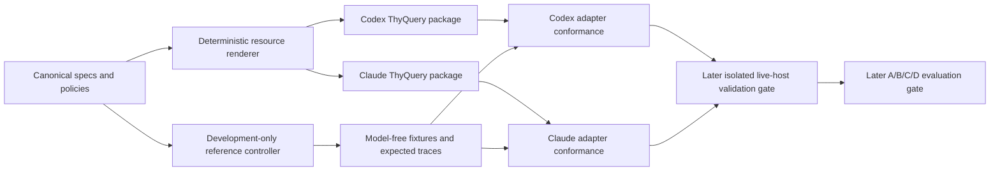

# ThyQuery Implementation Plan — `B-GUARDED`

## Metadata

- Plan ID: `IP`
- Version/path: `v1-B`
- Date: 2026-08-03 (Asia/Seoul)
- Based on: approved `DS@v2-B`
- Approved design SHA-256: `e9558d9edd18073ba36601c7c7ee76bc22aa1739080053baa04e69009b8f88da`
- Approval receipt: `approval_receipt_DS_v2_B.md`
- Selected architecture: `B-GUARDED`
- Current status: `IMPLEMENTATION_PLAN_APPROVAL_PENDING(IP@v1-B)`
- Planning modes used: product, UX/copy, technical, greenfield task creation

This artifact sequences implementation. It is not implementation, compatibility proof, installation authority, efficacy evidence, or permission to execute a generated native plan.

## 1. Goal, user, and observable outcome

### Goal

Build two thin, host-native, explicit-invocation plugins that run only inside an already-active stock Plan mode:

- Codex: `$thyquery <query>`
- Claude Code: `/thyquery:thyquery <query>`

Each plugin must use the same framework-neutral intent/state/closure contract, reduce material ambiguity and tacit implications through a bounded Ralph refinement region governed by a deterministic outer control graph, hand one accepted contract to the same host's native Plan behavior, observe one operationally native plan, and stop without executing it.

### Primary user

A Codex or Claude Code user who has a meaningful but incomplete request and wants a concrete native implementation plan without manually translating every hidden preference, implication, constraint, evidence requirement, or acceptance criterion into prompt text.

### Job to be done

When the user explicitly invokes ThyQuery in stock Plan mode, determine what must be clarified, researched, challenged, accepted as residual, or blocked; preserve user authority; and produce a decision-sufficient contract that the native planner can consume.

### Observable MVP outcome

For each supported host/version, an isolated conformance run must eventually show this sequence:

1. canonical explicit invocation is recognized;
2. verified Plan evidence is present before refinement;
3. material gaps are handled with native questions or bounded evidence actions;
4. only `EPISTEMIC_CLOSED` or `ACCEPTED_RESIDUAL` authorizes one handoff intent;
5. exactly one operationally native plan is observed;
6. no edit, shell mutation, plan execution, approval continuation, second plan, or blind retry follows;
7. every other outcome remains a typed non-success.

Until that live evidence exists, both host declarations remain `CONFORMANCE_UNTESTED`.

## 2. Authority and execution boundary

### What exact `IP@v1-B 승인` will authorize

- Create the workspace-local source, specification, test, fixture, documentation, and package files listed in this plan.
- Implement the dependency-free development reference controller and model-free test corpus.
- Implement one Codex package and one Claude Code package as instruction-first candidates.
- Run deterministic, no-network workspace tests and static/package validators that do not install or enable a plugin.
- Re-read current official host documentation and local `--help`/schema surfaces when required to keep manifests and validation commands version-correct.
- Update project-local planning and verification records.

### What exact `IP@v1-B 승인` will not authorize

- Persistent plugin installation, enablement, marketplace registration, or mutation of real Codex/Claude configuration.
- Interactive or paid model/evaluation runs, user simulation, human-subject evaluation, remote publication, or deployment.
- External graph/workflow packages, daemons, remote controllers, proxy CLIs, SaaS services, databases, telemetry exporters, or background agents.
- A runtime helper, hook-enforced controller, or durable checkpoint added silently after an instruction-only failure.
- Reading, changing, or deleting environment-owned `.remember/` artifacts.
- Executing any plan produced by ThyQuery.

After deterministic implementation review, a separately fingerprinted validation-run scope must authorize isolated live host probes. Persistent installation remains a later independent decision.

## 3. Fixed product behavior

### Invocation and mode rules

| Condition | Codex behavior | Claude Code behavior |
|---|---|---|
| Canonical invocation in verified Plan | Start one ThyQuery invocation | Start one ThyQuery invocation |
| Outside Plan or Plan evidence unavailable | `PLAN_MODE_REQUIRED`; no question, research, handoff, or plan | `PLAN_MODE_REQUIRED`; no question, research, handoff, or plan |
| Ordinary prompt | Untouched | Untouched |
| Automatic mode switch | Forbidden | Forbidden |
| Automatic prompt routing/hook interception | Forbidden | Forbidden |
| Final behavior | One native plan, then stop | One native plan, then stop |

The Claude convenience alias `/thyquery` may be tested later but is not canonical, portable, or required for support.

### Ralph action policy

The bounded Ralph region may propose only one current material-gap action at a time:

- native user question for a user-owned preference, commitment, authority, or acceptance;
- bounded primary-source research for an external factual gap;
- neutral interpretation/trade-off proposal for frame ambiguity;
- counterexample, scenario, or open-world challenge for a potentially wrong hypothesis frame;
- explicit contract-delta confirmation;
- typed block, cancel, residual-acceptance, or exhaustion result.

There is no fixed Top 3, fixed question count, or “one more critique” action. A repeated paraphrase, unchanged confidence, model-authored `done`, elapsed time, token limit, or hard cap is never success evidence.

### User authority rules

- High-impact implications stay hypotheses until confirmed, rejected, or residualized.
- Every native question must allow correction and, when meaningful, `모름/직접 입력/보류/취소` rather than forcing false alternatives.
- Research, benchmarks, or SOTA references cannot become user requirements without an explicit disposition.
- Silence, timeout, repeated clicks, fatigue, or a bare “괜찮아” cannot bind the current contract or residual ledger.
- A changed contract digest invalidates prior closure or residual acceptance.

## 4. UX states and canonical copy rules

The implementation may localize Korean/English presentation, but every message must preserve these meanings:

| State | Required meaning | Prohibited implication |
|---|---|---|
| Happy/refining | Name the one material gap and why answering or researching it may change the plan | “More questions are always better” |
| Pending user | Present neutral choices plus correction/defer/cancel paths | Forced-choice truth or pressure |
| Pending evidence | Name bounded scope, source standard, and expected decision impact | Unbounded “deep research” ceremony |
| `PLAN_MODE_REQUIRED` | ThyQuery did not start; enter stock Plan and invoke again | Claiming an automatic transition occurred |
| `ACCEPTED_RESIDUAL` | Enumerate residual, impact, mitigation, reversibility, and owner before explicit acceptance | Treating casual assent as closure |
| `STALLED` | State the repeated/oscillating/unproductive condition and remaining gaps | Calling stability “resolved” |
| `RESOURCE_EXHAUSTED` | State that a limit ended work without proving closure | Cap-as-success |
| `CANCELLED` | Confirm no handoff and no further effect | Continuing in the background |
| `STATE_CORRUPT` | Fail closed with the integrity reason and recovery boundary | Guessing or silently rebuilding state |
| `HANDOFF_OUTCOME_UNKNOWN` | State that application cannot be reconciled and do not retry | Exactly-once claim |
| `COMPLETE_AFTER_PLAN` | One native plan was observed; ThyQuery has stopped | Approval, implementation, or execution continuation |

Copy acceptance is semantic rather than byte-exact. Host-specific UI nouns may differ, but success/non-success and recovery boundaries may not be softened.

## 5. Architecture and dependency direction



### Authority boundaries

- `spec/` is the normative source for types, state partitions, guard precedence, graph edges, terminals, privacy rules, and handoff invariants.
- `src/reference/` is a development oracle for deterministic model-free tests. It is not automatically a shipped runtime dependency.
- `tools/render-plugin-resources.mjs` produces self-contained host-package reference snapshots from canonical specs.
- Each plugin package owns only its manifest, invocation instructions, host adapter mapping, host copy, and generated local reference snapshots.
- The model, native question tool, research tool, and host planner may propose observations/events but never redefine success or mutate canonical policy.
- No external graph runtime is part of the MVP.

### Instruction-first decision gate

The first shipped candidate is instruction-first because it is the thinnest host-native surface. The development oracle supplies expected behavior but is not invoked by the installed plugin.

Instruction-first is retained only if later isolated host traces satisfy G0/G1, including guard order, state lineage, cancellation, terminal absorption, one handoff intent, and no execution. If it fails:

1. mark the affected host `TRACE_INVALID` or `HOST_UNSUPPORTED`;
2. do not downgrade the invariant;
3. do not silently ship the development oracle as a runtime helper;
4. create a design revision comparing a tiny dependency-free helper, host hooks, or passive-shadow fallback, including runtime availability and privacy consequences;
5. require exact approval of that revision.

This stop condition prevents the plan from assuming that prompt instructions provide deterministic enforcement.

## 6. Proposed workspace layout

```text
AGENTS.md
README.md
package.json

spec/
  product-contract.md
  schemas/
    event-envelope.schema.json
    intent-contract.schema.json
    canonical-state.schema.json
    host-capabilities.schema.json
    handoff.schema.json
    terminal-outcome.schema.json
  graph/
    control-graph.v1.json
    guard-precedence.v1.json
    transition-invariants.md
  policies/
    action-policy.v1.md
    closure-policy.v1.md
    privacy-policy.v1.md
    evidence-policy.v1.md
  hosts/
    codex-0.146.0.md
    claude-code-2.1.220.md

src/reference/
  canonicalize.mjs
  reducer.mjs
  guards.mjs
  router.mjs
  replay.mjs
  graph-check.mjs

tools/
  render-plugin-resources.mjs
  validate-manifests.mjs
  validate-packages.mjs
  check-generated-parity.mjs
  replay-fixtures.mjs

plugins/codex-thyquery/
  .codex-plugin/plugin.json
  skills/thyquery/SKILL.md
  skills/thyquery/agents/openai.yaml
  skills/thyquery/references/
    protocol.generated.md
    graph.generated.md
    closure.generated.md
    codex-adapter.md
    copy.md

plugins/claude-thyquery/
  .claude-plugin/plugin.json
  skills/thyquery/SKILL.md
  skills/thyquery/references/
    protocol.generated.md
    graph.generated.md
    closure.generated.md
    claude-adapter.md
    copy.md

tests/
  unit/
  graph/
  fixtures/core/
  fixtures/codex/
  fixtures/claude/
  fixtures/privacy/
  fixtures/handoff/
  contracts/
  packaging/
  evaluation/dossiers/
  evaluation/rubrics/
  evaluation/preregistration.md

docs/
  architecture.md
  support-matrix.md
  privacy-and-retention.md
  validation.md
  installation-pending.md
```

`.planning/` remains the approval/research record. `.remember/` is environment-owned and excluded. No Git initialization is included.

## 7. Stack and implementation constraints

- Runtime candidate: host-native Markdown skill instructions and local reference files only.
- Development oracle/test tooling: zero-dependency ECMAScript modules using the locally observed Node.js toolchain and built-in test runner.
- External packages: none.
- Network behavior in deterministic tests: none.
- Persistent storage: none in the instruction-first MVP.
- Checkpoints: no durable checkpoint; any later need is a design revision.
- Telemetry: none.
- Secrets: none; fixtures must use synthetic or redacted content.
- Generated host resources: deterministic and hash/parity checked.
- Ordering: logical event sequence, never wall-clock timestamps.
- Parallel authoritative commits: excluded.

The implementation must not advertise Node as an end-user runtime requirement unless a later approved design deliberately moves the oracle into the runtime.

## 8. Canonical contracts to implement

### Event and state

The schemas must cover the approved event envelope and every state partition from `DS@v2`. The reducer must enforce:

- schema/policy/reducer version pins;
- invocation identity and original-query digest continuity;
- expected predecessor version and hash;
- idempotency-key same-payload replay;
- key collision with different payload as `STATE_CORRUPT(KEY_COLLISION)`;
- append-only correction/supersession lineage;
- one logical writer and serialized commits;
- deterministic canonical serialization and digest;
- terminal absorption.

### Guard and routing

The reference controller and rendered skill resources must share the exact frozen P0–P8 order:

`CANCEL/EFFECT_FENCE → INTEGRITY/ABSORPTION → HOST/NON-WAIVABLE → RESOLVED → ACCEPTED_RESIDUAL → RESOURCE_EXHAUSTION → PROGRESS_FAILURE → UNCERTAINTY_OWNER → ACTION_RANKING`

Any enabled incompatible same-priority edges without a frozen tie-break emit `STATE_CORRUPT(EDGE_CONFLICT)`.

### Closure

No implementation may replace the approved conjunction with a model confidence score. The policy representation must retain:

```text
EPISTEMIC_CLOSED :=
  GRAPH_OK
  AND PHILOSOPHICAL_OK
  AND COVERAGE_OK AND RISK_OK AND CONFLICT_OK
  AND STABLE_OK AND VOI_OK AND CAL_OK
  AND plan_input_ready
  AND no_unauthorized_intent_drift
  AND explicit_resolved_acceptance_binds_current_contract_digest
```

Numeric thresholds remain unset until calibrated. An uncalibrated stratum cannot emit `EPISTEMIC_CLOSED`; it must use a typed block or an explicitly accepted residual path.

### Handoff

- Handoff key: deterministic digest of invocation identity plus accepted current-contract digest.
- Only `EPISTEMIC_CLOSED` and `ACCEPTED_RESIDUAL` may propose it.
- Duplicate same-key intent returns the prior receipt and creates no second effect.
- Different contract digest requires a new closure/acceptance decision.
- Unknown applied/unapplied host outcome becomes `HANDOFF_OUTCOME_UNKNOWN` with no blind retry.
- `COMPLETE_AFTER_PLAN` absorbs all subsequent actions.

## 9. Iteration layering

### Iteration 1 — One model-free vertical path and two valid packages

Outcome: a synthetic invocation can move through validated events to a typed terminal in the reference controller, and each self-contained host package passes static validation without installation.

Included:

- canonical schemas and graph;
- reference reducer/guard/router/replay;
- deterministic generator and parity check;
- both manifests and minimal skills;
- a concrete-query path and an outside-Plan failure path.

Deferred:

- live host interaction;
- full ambiguity loop;
- efficacy evaluation;
- runtime helper or persistence.

### Iteration 2 — Complete guarded Ralph behavior and failure safety

Outcome: model-free fixtures cover native-question proposals, evidence/challenge proposals, contract updates, closure/residual acceptance, cancellation, cap, stall/cycles, corruption, replay, privacy, handoff fencing, and no-execution.

Included:

- all P0–P8 branches;
- all typed terminals;
- host-specific semantic adapters and copy;
- negative fixtures and invariant checks;
- static package validation.

Deferred:

- persistent installation;
- interactive host conformance;
- calibrated numerical thresholds.

### Iteration 3 — Validation and evaluation readiness

Outcome: the repository contains a frozen, separately approvable live-host validation matrix and A/B/C/D evaluation harness without claiming any live pass.

Included:

- per-host G0/G1 fixture manifests;
- synthetic dossiers and grading rubrics;
- `C−B` preregistration template;
- support matrix with `CONFORMANCE_UNTESTED` cells;
- installation document explicitly marked pending.

Deferred:

- interactive/paid model runs;
- efficacy claim;
- persistent installation and distribution.

## 10. Ordered vertical slices

### Slice 0 — Establish protected boundaries and reproducible tooling

- Value: implementation begins from an auditable empty-source baseline without overwriting planning or environment artifacts.
- Work: create `AGENTS.md`, `README.md`, and zero-dependency `package.json`; freeze allowed paths, host/version snapshot fields, canonical commands, no-network rule, and exclusions for `.planning/` and `.remember/`.
- Dependencies: exact `IP@v1-B` approval and hash verification.
- Acceptance:
  - only approved workspace paths are added;
  - no Git initialization, install, external package, home-directory write, or config mutation occurs;
  - Node test command runs without `npm install`.
- Verification: `rg --files -uu`, explicit path allowlist check, `npm test -- --test-name-pattern=baseline` or the recorded direct `node --test` equivalent.
- Rollback/safety: remove only files created by this slice after exact target review; never touch `.planning/` or `.remember/`.
- Change Review focus: authority boundary, path allowlist, hidden files, and dependency count.

### Slice 1 — Prove one deterministic state-to-terminal path

- Value: reviewers can see a real model-free implementation of the canonical contract before host prompts are authored.
- Work: implement schemas, canonical serialization, reducer, guard precedence, transition legality, typed terminals, and pure replay for two paths: verified-Plan concrete request and missing-Plan rejection.
- Files: `spec/schemas/`, `spec/graph/`, `src/reference/`, `tests/unit/`, `tests/fixtures/core/`.
- Dependencies: Slice 0.
- Acceptance:
  - identical ordered events produce identical canonical state and digest;
  - event order or payload changes alter the expected digest;
  - missing Plan yields only `PLAN_MODE_REQUIRED`;
  - a cap cannot create success;
  - pure replay records zero effects.
- Verification: `node --test tests/unit tests/contracts` and `node tools/replay-fixtures.mjs tests/fixtures/core`.
- Rollback/safety: no host calls or generated packages.
- Change Review focus: canonicalization, hash scope, total guard ordering, and success/non-success separation.

### Slice 2 — Render two self-contained host packages from one semantic contract

- Value: Codex and Claude receive their native invocation grammar without duplicating the normative protocol by hand.
- Work: create both manifests, minimal `SKILL.md` entrypoints, host adapter references, deterministic resource renderer, and byte/parity receipts for generated protocol/graph/closure references.
- Files: `tools/render-plugin-resources.mjs`, `plugins/codex-thyquery/`, `plugins/claude-thyquery/`, `tests/packaging/`.
- Dependencies: Slice 1 contracts frozen for version `v1`.
- Acceptance:
  - Codex manifest is under `.codex-plugin/plugin.json` and exposes skill `thyquery`;
  - Claude manifest is under `.claude-plugin/plugin.json` and canonical invocation is `/thyquery:thyquery`;
  - generated semantic resources match the same source digests;
  - no absolute paths, secrets, remote endpoints, post-install scripts, or undeclared dependencies exist;
  - ordinary-prompt hooks are absent.
- Verification: render twice and compare hashes; `node tools/validate-packages.mjs`; `node tools/check-generated-parity.mjs`.
- Rollback/safety: packages remain workspace-local and uninstalled.
- Change Review focus: native grammar, self-containment, manifest fields, and false cross-host parity.

### Slice 3 — Deliver the one-gap native-question journey

- Value: an ambiguous user request is reduced through one material, user-owned question rather than a fixed questionnaire.
- Work: encode gap diagnosis, owner classification, native-question proposal, neutral option construction, correction/defer/cancel paths, response validation, provenance, contract delta, and guard recomputation in both adapter instruction sets and reference fixtures.
- Files: `spec/policies/action-policy.v1.md`, both adapter/copy files, `tests/fixtures/codex/`, `tests/fixtures/claude/`, `tests/contracts/`.
- Dependencies: Slice 2.
- Acceptance:
  - one highest-materiality gap is selected;
  - option count is adaptive and includes a non-forced path where material;
  - user responses are proposals until validated and committed;
  - a correction supersedes and invalidates dependents;
  - unchanged response/state does not count as progress;
  - Codex and Claude traces have equivalent semantic outcomes without claiming identical tool events.
- Verification: model-free expected-trace tests plus package-reference parity tests.
- Rollback/safety: no actual question tool is invoked in this slice.
- Change Review focus: user authority, false alternatives, provenance, and cross-host semantic equivalence.

### Slice 4 — Deliver evidence, challenge, and honest non-success journeys

- Value: external facts are researched only when decision-relevant, and wrong frames or unproductive loops terminate honestly.
- Work: add bounded evidence action envelopes, source/evidence status, contradiction and supersession rules, open-world challenge, exact-repeat/oscillation/semantic-stall/SCC diagnostics, budgets, and non-success copy.
- Files: `spec/policies/evidence-policy.v1.md`, `spec/graph/`, reference controller, plugin references, `tests/graph/`, `tests/fixtures/core/`.
- Dependencies: Slice 3.
- Acceptance:
  - user-owned preferences never route to web research as a substitute for asking;
  - external factual claims require evidence references and freshness/scope fields;
  - cycle, cap, stall, unavailable tool, and uncalibrated closure never map to success;
  - a frame challenge can reopen contract fields and invalidate closure;
  - every active macrostep decreases the bounded transition variant exactly once.
- Verification: graph reachability/SCC checks; one positive and negative fixture per guard; exact-repeat and period-`p` oscillation fixtures.
- Rollback/safety: tests use synthetic evidence only and no network.
- Change Review focus: action ownership, boundedness-versus-success, and wrong-fixed-point prevention.

### Slice 5 — Deliver closure, residual acceptance, and privacy projections

- Value: the user can finish with decision-sufficient grounding or knowingly accept enumerated residuals without the plugin pretending to read their mind.
- Work: implement graph/philosophical/R4 closure representation, calibration-required behavior, current-digest acceptance, residual ledger, minimum-disclosure projections, trace redaction, and terminal-specific copy.
- Files: `spec/policies/closure-policy.v1.md`, `privacy-policy.v1.md`, relevant schemas, both packages, `tests/fixtures/privacy/`, closure tests.
- Dependencies: Slice 4.
- Acceptance:
  - all closure conjuncts are independently represented and recomputed;
  - unset calibration blocks resolved success;
  - accepted residuals include provenance, impact, mitigation, reversibility, and owner;
  - acceptance binds the current ledger/contract digest;
  - secrets/raw personal identifiers do not appear in allowed trace projections;
  - cancellation discards invocation-scoped working state according to the no-persistence design.
- Verification: closure truth-table tests, mutation tests that flip each conjunct, redaction fixtures, digest-invalidation fixtures.
- Rollback/safety: only synthetic sensitive fixtures; no durable state.
- Change Review focus: exhaustive-mind-reading claims, acceptance coercion, calibration state, and privacy leakage.

### Slice 6 — Deliver one fenced native-plan handoff journey

- Value: only an accepted current contract can reach one native plan, and ambiguous application never triggers a duplicate.
- Work: implement handoff intent schema/key, legal predecessor checks, duplicate suppression, plan observation representation, outcome reconciliation, `HANDOFF_OUTCOME_UNKNOWN`, `COMPLETE_AFTER_PLAN`, and forbidden post-plan transitions in specs, reference controller, and adapter instructions.
- Files: `spec/schemas/handoff.schema.json`, reference controller, both host adapter files, `tests/fixtures/handoff/`.
- Dependencies: Slice 5.
- Acceptance:
  - only two authorized closure kinds reach handoff;
  - one invocation/contract digest produces at most one logical handoff intent;
  - an unknown host outcome forbids retry;
  - a second plan, edit, shell mutation, approval continuation, or execution after plan is a hard fixture failure;
  - no documentation claims native exactly-once support before live evidence.
- Verification: handoff-dominator check, duplicate/crash/reconcile fixtures, terminal absorption tests, forbidden-path search.
- Rollback/safety: no real planner is invoked.
- Change Review focus: at-most-once versus exactly-once wording, effect fencing, and native-plan provenance unknowns.

### Slice 7 — Complete model-free conformance and package validation

- Value: the implementation is reviewable without trusting model output or installing either plugin.
- Work: assemble all edge/invariant/replay/privacy/packaging fixtures, host semantic matrices, deterministic package digests, and validation report generator.
- Files: `tests/`, `tools/`, `docs/validation.md`, `docs/support-matrix.md`.
- Dependencies: Slices 1–6.
- Acceptance:
  - forward/reverse reachability, terminal absorption, SCC exits, guard totality, and conflict checks pass;
  - every edge has positive and negative fixtures;
  - replay has zero effect proposals;
  - generated package parity passes;
  - `claude plugin validate --strict plugins/claude-thyquery` passes or a precise current-schema blocker is recorded;
  - Codex result is labeled static-only because current CLI exposes no direct local validator;
  - support matrix still says `CONFORMANCE_UNTESTED` for live host behavior.
- Verification: one documented `npm test` aggregate plus the Claude strict validator; no install command.
- Rollback/safety: failed validation blocks continuation; do not weaken schemas to make fixtures green.
- Change Review focus: scope of PASS and absence of unsupported host claims.

### Slice 8 — Prepare, but do not run, live-host conformance

- Value: the next approval can authorize a finite, inspectable run rather than an open-ended test session.
- Work: freeze per-host G0/G1 cases for canonical invocation, Plan receipt, outside-Plan fail-closed behavior, native question, cancel, one plan, no execution, uncertain handoff, clear-query no-harm, and instruction-first guard compliance; specify isolation, receipts, cost accounting, and cleanup.
- Files: `tests/fixtures/codex/live-manifest.json`, `tests/fixtures/claude/live-manifest.json`, `docs/validation.md`, a separately fingerprinted validation-run proposal.
- Dependencies: Slice 7 and change review with no blocking model-free defect.
- Acceptance:
  - every proposed live case names host/version/surface, preconditions, action budget, expected events, forbidden effects, cleanup, and verdict mapping;
  - Codex configuration/marketplace mutation and Claude plugin loading are isolated or explicitly deferred;
  - no live model call or plugin install occurs under this slice.
- Verification: schema-check the run manifests and review their finite case count and effect budget.
- Rollback/safety: not applicable; this is a plan/fixture artifact only.
- Change Review focus: isolation, cost, persistence, cleanup, and honest `HOST_UNSUPPORTED` paths.

### Slice 9 — Prepare, but do not run, the A/B/C/D evaluation

- Value: any later graph-performance claim is causally separable from the existing intent-loop benefit.
- Work: create synthetic/sealed intent dossiers, task strata, A/B/C/D arm renderers, outcome schemas, grading rubrics, negative controls, pilot-to-confirmatory freeze procedure, and no-harm/burden/privacy metrics.
- Files: `tests/evaluation/`, `docs/validation.md`.
- Dependencies: Slice 7; live G0/G1 must pass before a confirmatory run is eligible.
- Acceptance:
  - `B−A`, `C−B`, and `D−C` are reported separately;
  - B and C share model, prompts, tools, facts, budgets, question/action repertoire, and planner;
  - thresholds/sample sizes remain `UNSET_PENDING_PILOT` rather than invented;
  - graph claim fails as `NO_GRAPH_BENEFIT_SHOWN` unless G2 and no-regression gates pass;
  - no evaluation is executed under this implementation plan.
- Verification: fixture/schema tests and blinded rubric review only.
- Rollback/safety: synthetic dossiers only; no user data.
- Change Review focus: causal estimand, matched budgets, leakage, grader calibration, and claim language.

### Slice 10 — Produce the implementation review packet

- Value: the user receives a precise account of what was built, what passed, what remains untested, and which next action needs authority.
- Work: run the allowed deterministic checks, inspect diffs and package contents, record hashes and dependency/network receipts, update support/unknowns, and produce a change-review artifact plus the bounded live-validation proposal.
- Dependencies: Slices 0–9.
- Acceptance:
  - every claim is scoped to static, unit, fixture, package, or live evidence actually observed;
  - no live host or efficacy pass is implied;
  - workspace changes exclude `.remember/` and unrelated files;
  - no subagent session remains running; any flat branch used later is integrated and immediately cleaned;
  - the next approval request is exact and fingerprinted.
- Verification: explicit file allowlist, hashes, test receipts, dependency inventory, network receipt, and live-agent audit.
- Rollback/safety: no installation or external state to roll back.
- Change Review focus: evidence-to-claim correspondence and remaining host/product risk.

## 11. Aggregate verification matrix

| Gate | Required evidence before claiming PASS | Failure result |
|---|---|---|
| Source boundary | Only listed workspace files changed; `.planning/` records intentional; `.remember/` untouched | `SCOPE_VIOLATION` |
| Dependency | No external runtime/package; lockfile absent unless separately approved | `THINNESS_FAILED` |
| Canonical state | Same event stream/version yields same state/digest | `TRACE_INVALID` |
| Graph integrity | Reachability, total guards, conflict resolution, absorption, SCC fixtures | `TRACE_INVALID` |
| Closure | Every conjunct and digest acceptance independently tested | `PREMATURE_CLOSURE` |
| Boundedness | Finite variant decreases; cap remains non-success | `LIVENESS_CONTRACT_FAILED` |
| Replay | Pure fold produces zero effects | `REPLAY_EFFECT_LEAK` |
| Privacy | Synthetic secret/identifier fixtures excluded from allowed traces | `PRIVACY_GATE_FAILED` |
| Handoff | One logical intent; unknown outcome no retry; post-plan absorption | `HANDOFF_GATE_FAILED` |
| Package | Self-contained manifests/resources; native grammar; no hidden routing | `PACKAGE_INVALID` |
| Codex live | Later exact G0/G1 run | `CONFORMANCE_UNTESTED` until run; then `HOST_UNSUPPORTED` on failure |
| Claude live | Later exact G0/G1 run | `CONFORMANCE_UNTESTED` until run; then `HOST_UNSUPPORTED` on failure |
| Graph increment | Later frozen paired `C−B` confirmatory gate | `NO_GRAPH_BENEFIT_SHOWN` |

## 12. Risks, blockers, and stop conditions

### Blocking unknowns

1. A standard instruction skill may not receive trustworthy Plan-mode evidence.
2. Instruction-first execution may not obey deterministic guard/reducer semantics.
3. Neither host may expose an authoritative contract-to-native-plan receipt or handoff reconciliation API.
4. Codex local plugin validation currently appears marketplace-oriented and may require a separate isolated configuration design.
5. Calibration targets for coverage, risk, stability, VOI, burden, and semantic stall are unset.

### Mandatory stops

- If current official manifest grammar contradicts the proposed package layout, revise the artifact before writing around the schema.
- If deterministic tests expose incompatible P0–P8 semantics, fix the spec/controller rather than weakening fixtures.
- If instruction-first live traces later violate G1, stop and reopen architecture; do not add a helper implicitly.
- If a host lacks Plan receipt or native-plan/no-execution evidence, mark that host unsupported rather than shipping a partial compatibility claim.
- If `C−B` later fails, remove graph-quality claims and seek approval for the loop-only/passive-shadow fallback.
- If user data or persistent state becomes necessary, stop for a privacy/storage design revision.

### Scope trade-offs

- Separate package roots add small duplication but make host-specific failure and conformance visible.
- A development oracle improves testability but does not itself enforce runtime behavior.
- Deferring persistence simplifies privacy and replay but prevents crash resume.
- Deferring live runs prevents premature compatibility claims but requires another explicit validation checkpoint.

## 13. Parallelism and lifecycle

Implementation should remain root-owned and sequential through the canonical contracts and generated-resource interface. After Slice 2 freezes those interfaces, Codex and Claude adapter work may be assigned only as two flat, non-recursive, disjoint branches if parallelism materially helps.

Any such branch must:

- own exactly one plugin root and host-specific fixtures;
- not edit `spec/`, shared tools, planning files, or the other plugin;
- spawn no descendants;
- return a digest and verification receipt;
- be integrated, audited, and immediately stopped/cleaned before the next phase.

Shared-core, graph, closure, privacy, and handoff work stays with root to avoid split authority.

## 14. Acceptance criteria for the implementation plan itself

This `IP@v1-B` is review-ready only if it:

- preserves every active `DS@v2-B` boundary and excludes superseded automatic-routing/forced-mode requirements;
- identifies the user, product behavior, UX states, technical boundaries, exact proposed paths, and non-goals;
- sequences reviewable vertical slices rather than horizontal component buckets;
- gives each slice dependencies, acceptance, verification, rollback/safety, and review focus;
- separates static/model-free, package, live-host, and efficacy validation surfaces;
- carries every material unknown forward with a stop condition;
- neither installs nor implements anything;
- ends at an exact approval gate.

## 15. Recommended handoff

After exact plan approval, the next Keystone module is `implementation`, beginning with Slice 0 and stopping after Slice 10 at change review plus a separately fingerprinted live-validation proposal.

Implementation must start by re-verifying this artifact's final SHA-256, the exact approval receipt, current workspace allowlist, and current host/tool versions. Any material drift in official manifest grammar, host mode surfaces, or native planner events pauses work for a plan revision.

## 16. Keystone checkpoint

```text
Keystone checkpoint: product-planning -> task-creation -> implementation
Current skill: task-creation
Completed: DS@v2-B exact approval and digest verified; B-GUARDED product/UX/technical rules converted into 11 vertical slices with file ownership, acceptance, verification, risks, and stop conditions
Blocked by: exact approval of this separately fingerprinted IP@v1-B artifact
Next check: re-hash IP_v1_B.md, match the user's exact approval, inspect the workspace allowlist, and start Slice 0 without installation or external packages
Action: ask user
Todo tail: Next / upcoming task: implementation — verify IP@v1-B authority and execute Slice 0
Prompt: IP@v1-B 승인
```

## 17. Approval boundary

To approve the workspace-only implementation and deterministic/static validation scope defined above, reply exactly:

`IP@v1-B 승인`

This approval will not authorize persistent installation, live/paid host runs, efficacy evaluation, deployment, publication, configuration mutation, or execution of a generated plan. Any material combination or scope change requires a new fingerprinted revision.
