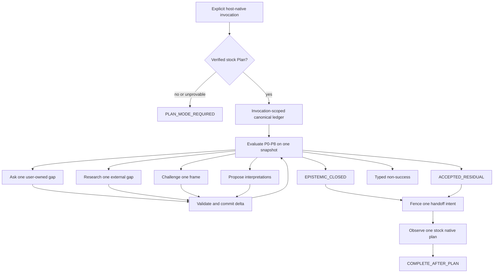

# ThyQuery Architecture

ThyQuery uses `B-GUARDED`: a deterministic, framework-neutral control contract surrounds a bounded Ralph refinement region. The graph exists as a normative specification and development oracle; the shipped candidates are host-native instruction skills, not a graph-runtime dependency.

## Authority layers

| Layer | Owns | Does not own |
|---|---|---|
| `spec/` | Types, guards, graph, closure, evidence, privacy, handoff invariants | Host execution |
| `src/reference/` | Deterministic canonicalization, reducer, guard routing, replay, graph checks | Shipped runtime enforcement |
| Generated references | Byte-equal semantic snapshots consumed by both skills | Normative edits |
| Host adapter | Invocation grammar, native question mapping, Plan evidence, copy, plan observation | Success redefinition |
| Stock Plan | One final native plan artifact | ThyQuery state or post-plan execution |

## State and events

One invocation owns one ordered event stream and one logical writer. Events pin schema, policy, reducer, invocation, predecessor version/hash, and an idempotency key. Same-key/same-payload replay is a no-op; same-key/different-payload is corruption. The derived state hash excludes only its own hash field.

Active user/evidence/contract/frame macrosteps decrease one natural-number transition budget. This proves finite controller work, not epistemic correctness. Plan preflight, guard recomputation, observations, and pure verification replay consume no active unit.

## Closure and handoff

Success requires the full closure conjunction or explicit current-digest residual acceptance. Both are Ralph-region authorizers rather than product completion. One deterministic invocation/contract handoff key fences the native-plan intent. An ambiguous application stops as `HANDOFF_OUTCOME_UNKNOWN`; it is not blindly retried.

`COMPLETE_AFTER_PLAN` is absorbing. A second plan, edit, command, approval continuation, or execution is prohibited.

## Instruction-first feasibility boundary

The skills describe the contract but do not run `src/reference/`. Static green tests therefore establish specification and package consistency only. Later isolated G0/G1 traces must demonstrate trustworthy Plan evidence, state lineage, guard order, one handoff, one native plan, and no execution. Failure stops the affected host and triggers a separately approved runtime/privacy design revision; it never silently promotes the oracle into production.
